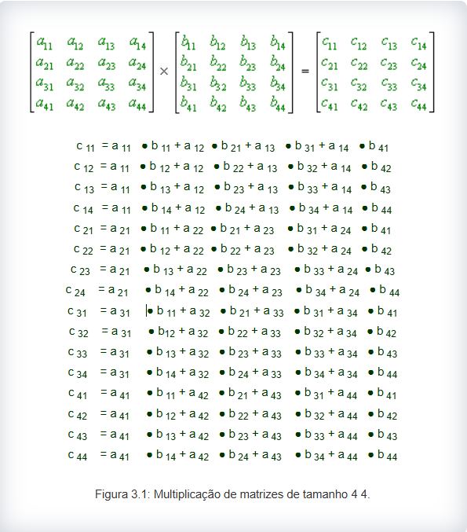
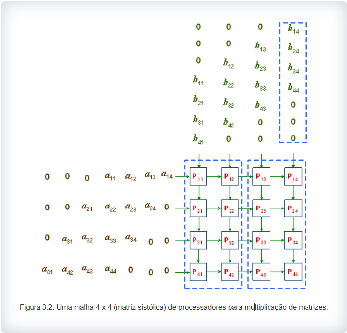
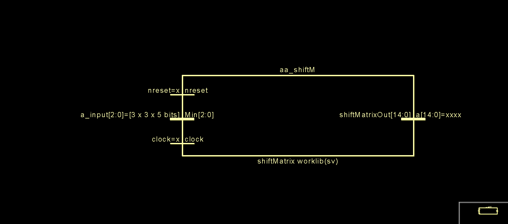
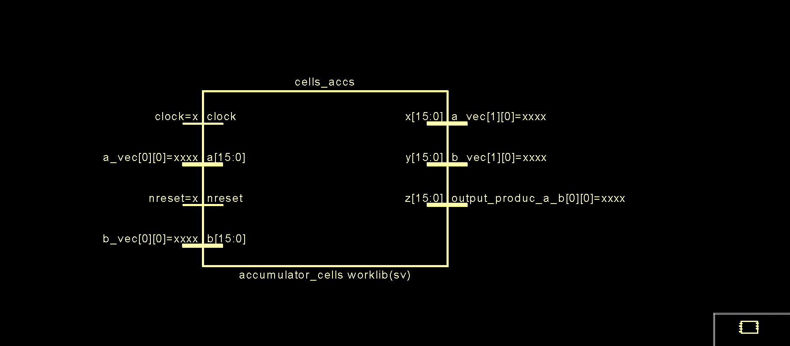
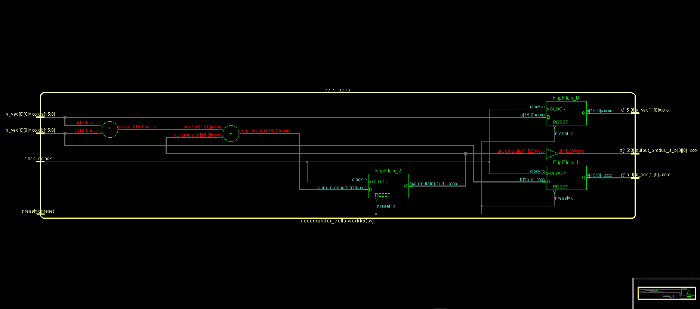
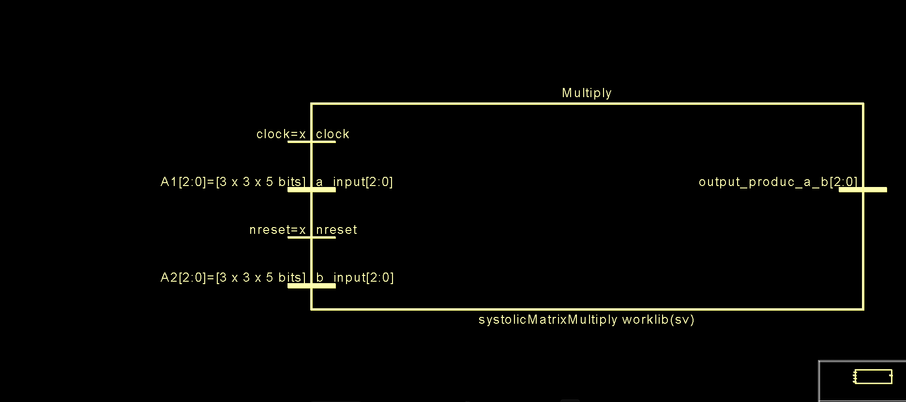
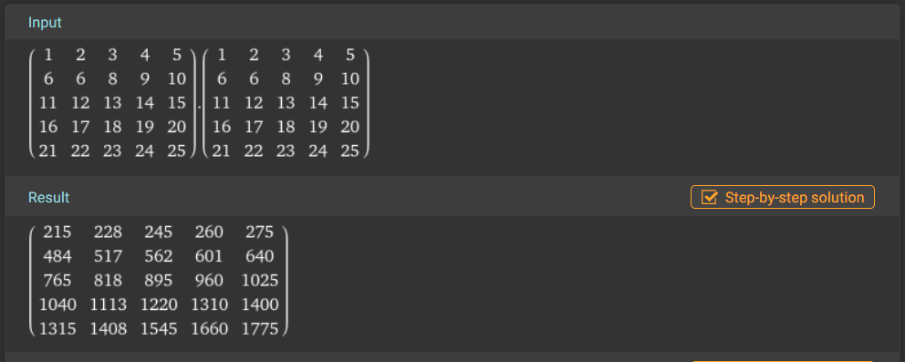
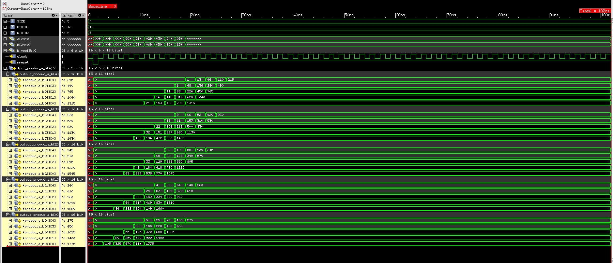

# Implementação em Hardware de um Acelerador de Multiplicação de Matrizes de Ordem N Systólica


## Objetivos
A multiplicação de matrizes é uma operação muito comum em problemas científicos e de engenharia. A implementação sequencial dessa operação consome muito tempo para matrizes grandes; a solução de força bruta resulta em um tempo computacional O(n^3) , para matrizes nxn ...


## Introdução 

Computadores paralelos bidimensionais conectados em malha são frequentemente utilizados em configuração de matriz sistólica para a multiplicação de matrizes. Para simplificar, assumimos matrizes de entrada de tamanho 4 x 4 contendo elementos inteiros de um bit. A Figura 3.1 mostra as operações a serem realizadas. Os símbolos ● e + representam as operações inteiras de multiplicação e adição, respectivamente.

<p align="center">

</p>

As duas matrizes A e B são deslocadas para os processadores de contorno na coluna 1 e linha 1, respectivamente, conforme mostrado na Figura. Os 0s à esquerda e à direita nas linhas e colunas são empregados para que os elementos air e Brj cheguem ao núcleo Pij simultaneamente para que a operação Air ● Brj seja executada. Cij é inicializado como 0 em Pij , para todos os i, j = 1, 2, 3, 4. No final, o núcleo Pij conterá cij , para 1 ≤ i, j ≤ 4

Sempre que um processador Pij recebe duas entradas b e a do norte e do oeste, respectivamente, ele executa o seguinte conjunto de operações, nesta ordem:

ele calcula a ● b ;
ele adiciona o resultado ao valor anterior Cij e armazena o resultado em Cij ;
ele envia a para Pi,j+1 , a menos que j = 4 ; e
ele envia   b para Pi+1, j , a menos que i = 4 .
Este algoritmo leva tempo O(n) , para   matrizes n xn .

<p align="center">

</p>

## Descrição do Bloco ShiftMatrix
Este módulo estrutura as matrizes de acordo com a topologia do acelerador.


``Exemplo:``

$$
M = \begin{pmatrix}
A_{00} & A_{01} & A_{02} \\
A_{10} & A_{11} & A_{12} \\
A_{20} & A_{21} & A_{22} \\
\end{pmatrix}
$$

`` A saída será as colunas de: ``

$$
M = \begin{pmatrix}
   & 0 & 0 & A_{00} & A_{01} & A_{02} \\
   & 0 & A_{10} & A_{11} & A_{12} & 0 \\
   & A_{20} & A_{21} & A_{22}& 0 & 0 \\
\end{pmatrix}
$$
## Interface de Conexão do ShiftMatrix

```verilog

module shiftMatrix#(parameter WIDTH, SIZE)(
    input  logic nreset                                 , 
    input  logic clock                                  ,
    input  logic [WIDTH-1:0] Min[SIZE-1:0][SIZE-1:0]    ,
    output logic [SIZE*WIDTH-1:0] shiftMatrixOut 
);

WIDTH: Quantidade de bits de cada elemento da matriz
SIZE : Dimensão da matriz

Entradas:
    clock
    nreset -> Reset Sincrôno
    Min    -> Matriz de Entrada
Sáida 
    ShiftMatrixOut -> Matriz de sáida da forma Coluna_j de M

````

## Símbolo do Bloco ShiftMatrix

<p align="center">

</p>


## Descrição do Bloco Accumulator

Este módulo é a núcleo do acelerador. Composto por um somador e um multiplicador responsável por acumular o produto das linhas/colunas da multiplicação das matrizes


## Interface de Conexão do Accumulator

```verilog

module accumulator_cells#(
    parameter WIDTH = 16
)(

    input  logic             clock   ,
    input  logic             nreset  ,
    input  logic [WIDTH-1:0] a       ,
    input  logic [WIDTH-1:0] b       ,
    output logic [WIDTH-1:0] x       ,
    output logic [WIDTH-1:0] y       ,
    output logic [WIDTH-1:0] z       
);

WIDTH: Quantidade de bits do acumulador
Entradas:
    clock
    nreset -> Reset Sincrôno
    a      -> operando 1
    b      -> operando 2
Sáida 
    z       -> Resultado do produto das Linhas
    x       -> Pipeline do operando a
    y       -> Pipeline do operando b
````

## Símbolo do Bloco Accumulator

<p align="center">

</p>

## Visão Interna do Bloco

<p align="center">

</p>


## Descrição do Bloco SystolicMatrixMultiply

Este módulo é o Acelerador de multiplicação de matrizes.

## Interface de Conexão do  SystolicMatrixMultiply

```verilog

module systolicMatrixMultiply#(
    parameter WIDTH = 16, SIZE=3, WIDTHx = 4
)(
    input  logic                  clock                                  ,
    input  logic                  nreset                                 ,
    input  logic [WIDTHx-1:0]     a_input [SIZE-1:0][SIZE-1:0]           ,
    input  logic [WIDTHx-1:0]     b_input [SIZE-1:0][SIZE-1:0]           ,
    output logic [WIDTH-1:0]      output_produc_a_b [SIZE-1:0][SIZE-1:0]
);
WIDTHx: Quantidade de bits de cada elemento da matriz
WIDTH : Quantidade de bits do acumulador
SIZE  : Dimensão da matriz

Entradas:
    clock
    nreset  -> Reset Sincrôno
    a_input -> Operando 1
    b_input -> Operando 2
Sáida 
    output_produc_a_b -> Resultado
````

## Símbolo do Bloco SystolicMatrixMultiply

<p align="center">

</p>

## Teste Funcional de uma multiplicação Matricial de Ordem 5

Dada a matriz:

$$ M = \begin{pmatrix}
& 1 & 2 & 3 & 4 & 5 \\
& 6 & 7 & 8 & 9 & 10 \\
& 11 & 12 & 13 & 14 & 15 \\
& 16 & 17 & 18 & 19 & 20 \\
& 21 & 22 & 23 & 24 & 25 \\
\end{pmatrix}\ $$

$$Calcule: M^2 $$

<p align="center">

</p>


<p align="center">

</p>

## Referências
[Systolic-Array Implementation of Matrix-By-Matrix Multiplication](https://ecelabs.njit.edu/ece459/lab3.php).
